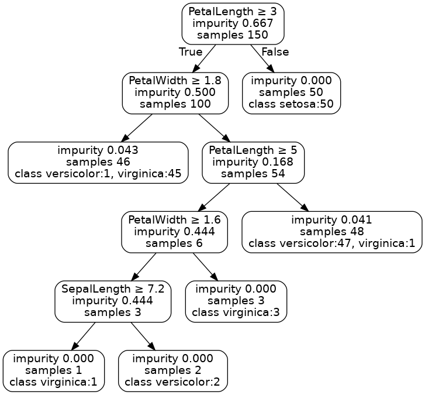
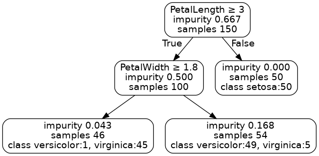

# 朴素贝叶斯算法
## 算法流程
1. 加载训练数据；
2. 计算当前的Gain；
3. 循环遍历每个特征，将该特征的所有值存入set中；
4. 循环遍历每个特征值，按照该特征对数据集进行划分；
5. 计算Gain，更新最大的Gain并记录是哪一个特征和哪个值产生的；
6. 根据设置的miniGain来判断是否继续建立子树（剪枝），如果best_gain大于minGain，则递归调用建树函数建立当前节点的左右子树；否则保存结果，该点作为叶子节点；

## 结果
当设置minGain=0.05时生成的决策树图像如下：

当设置minGain=0.1时生成的决策树图像如下：

当设置minGain=0.1时生成的决策树图像如下：

