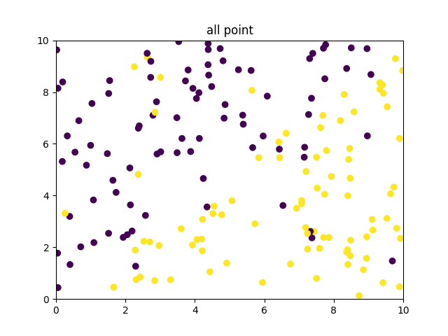
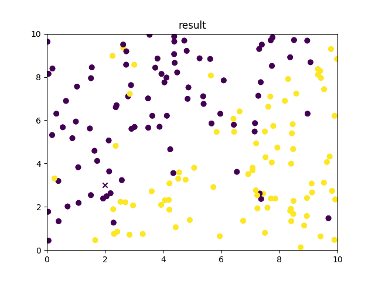

# KNN算法
## 算法流程
1. 加载数据；
2. 计算测试点与所有训练集的点之间的距离（欧氏距离）；
3. 对距离进行排序，选择与测试点最近的k个点；
4. 计算最近的k个点的标签出现的次数，找到出现次数最多的标签作为测试点的标签。

## 结果
加载数据：  
  
对点(2,3)进行分类，结果如下图：  
  
其中紫色和黄色分布是两种类别，可以看到(2,3)位置是一个紫色的X  
随机生成十个点进行分类，分类的结果如下图：  
  
通过肉眼观察发现，分类的准确率比较高。
