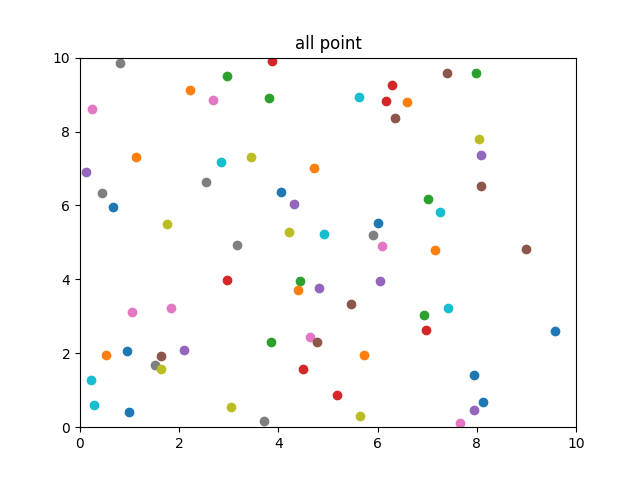
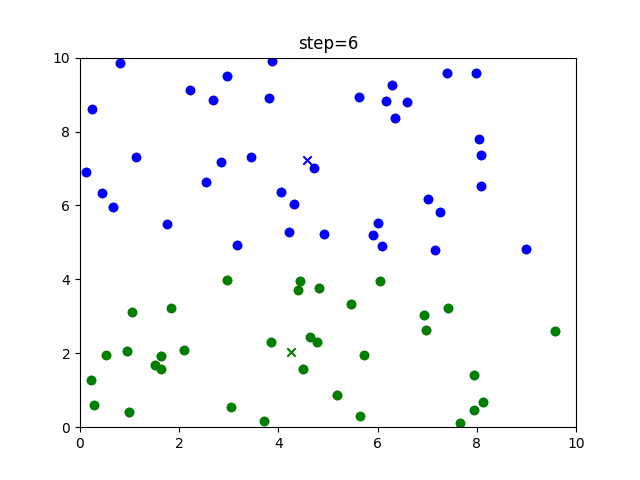
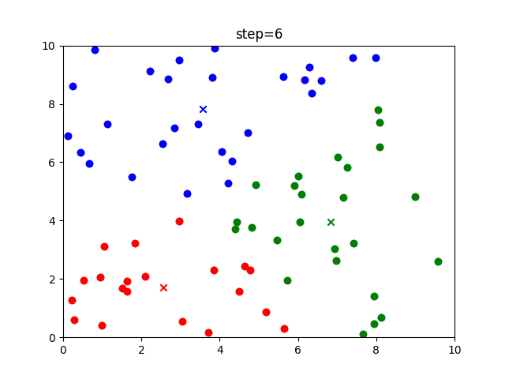
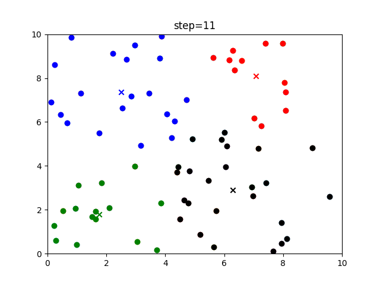

# Kmeans算法
## 算法流程
1. 加载数据；
2. 随机生成k个点作为初始的质心点；
3. 将每个点的标签选择为与它最近的质心点（本文选用欧氏距离）每个点和最近的质心点结合成了k个簇；
4. 将每个簇的坐标的平均值作为该簇的新质心点
5. 重复3）- 4）直到每个点对应的簇都不发生变化或者达到最大迭代次数

## 结果
加载数据

当k=2时，通过6次迭代将数据聚类后结果如下图：

其中相同颜色的点表示在同一个簇中，x表示该簇的质心点，上方的step表示迭代次数。从图中可以看到，能够比较明显的将图中的点分成两类。

当k=3和4时，数据聚类后结果如下图：

