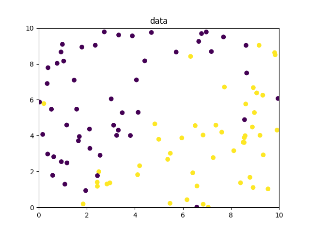
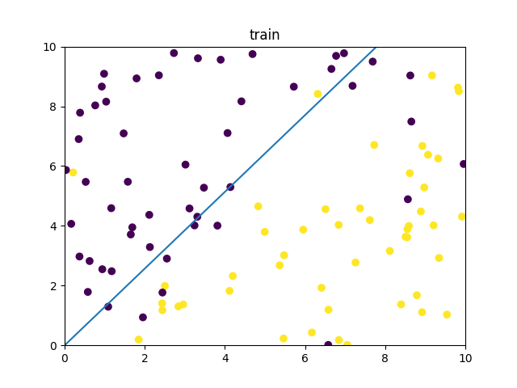
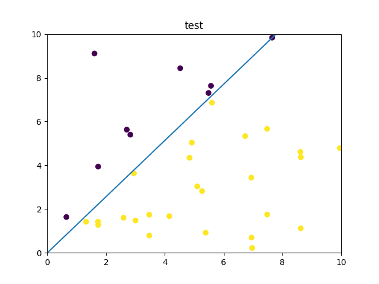

# KNN算法
## 算法流程
1. 加载训练数据和测试数据；
2. 计算预测函数h(x)；
3. 计算损失函数J(w)；
4. 根据误差修改回归权重参数；
5. 重复2.- 4. n次（最大迭代次数）

## 结果
加载训练数据：  
  
其中紫色和黄色分别表示两种类别。  

训练后，得到的分类曲线如图：  
  
可以看到训练得到的曲线能够比较好的将两种类别的点分割开来。
  
对测试集进行分类，得到测试集的标签如下图所示：  

