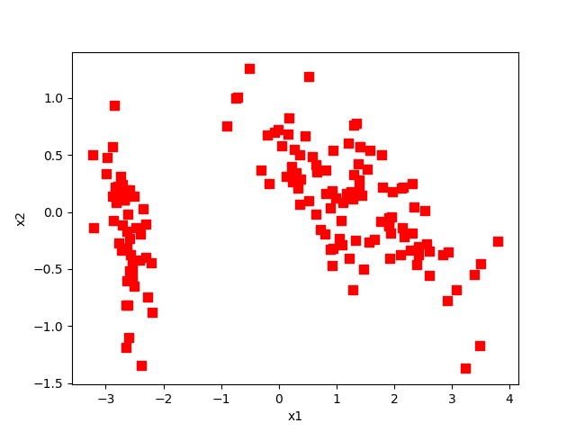

# PCA算法
## 算法流程
1. 加载数据；
2. 对数据进行零均值化处理（将数据通过每一列求到每一个特征的平均值，然后所有数据减去它的平均值）；
3. 求出数据的协方差矩阵；
4. 计算协方差矩阵的特征值和特征向量；
5. 对特征值进行排序，得到排序后的下标；
6. 取特征值前k大的特征向量；
7. 将零均值化后的数据与前k大的特征向量相乘得到降维后的数据。

## 结果
对数据进行降维后，得到二维的特征，其在二位坐标上的位置如下：

