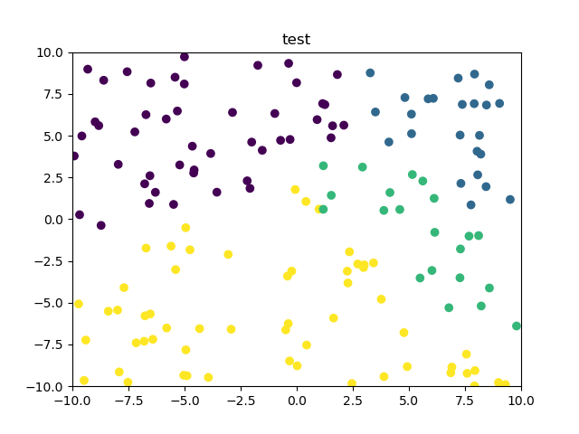

# KNN算法
## 算法流程
1. 加载训练数据和测试数据；
2. 初始化weights和bias；
3. 计算每个分类的分数score；
4. 对score计算softmax得到预测概率h(x)；
5. 计算损失函数J(w)；
6. 求导并更新参数w和b
7. 重复2）- 4）n次（最大迭代次数）

## 结果
加载训练数据：

其中蓝色，黄色，紫色，绿色分别表示四个种类别。

通过训练后对测试集进行分类，得到测试集的标签如下图所示：

可以看到，对测试集进行了较好的分类。