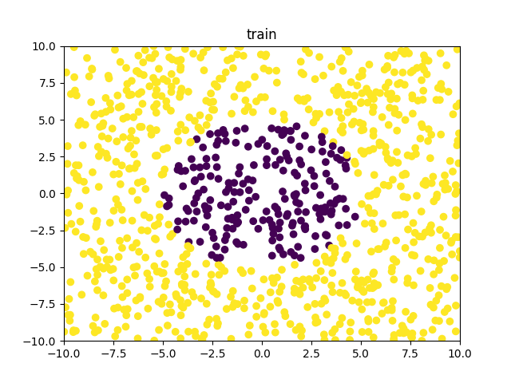
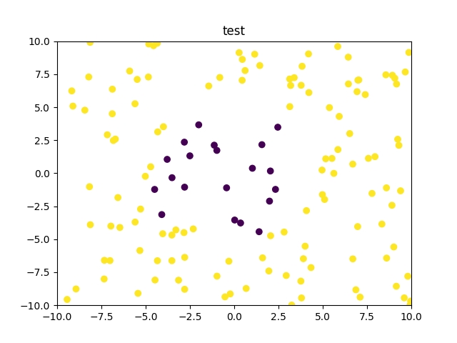

# KNN算法
## 算法流程
1. 加载训练数据和测试数据；
2. 初始化weights、bias和每一层的信息；
3. 循环训练每一个输入数据
4. 正向传播，将每一层的输出数据作为下一层的输入数据，计算最后的输出；
5. 计算loss；
6. 误差反向传播，计算每一层的导数；
7. 循环更新每一层的参数；
8. 重复3）- 7）n次（最大迭代次数）

## 结果
加载训练数据：

其中黄色和紫色分别表示两种类别。

对训练集进行训练得到loss曲线：

 

可以发现，在大概75个epoch后，loss接近趋于饱和，之后的曲线接近平行。在150个epoch后修改学习率降为原来的1/10后，loss略有降低。

通过训练后对测试集进行分类，得到测试集的标签如下图所示：

可以看到，对测试集进行了较好的分类。

